

    <h1 align="center">在线教学考试系统</h1>

	
    
    
    

## 一、简单讲讲

繁星之辰是一款基于SSMP开发的在线教学考试系统，系统主要提供**视频学习**、**资料共享**、**信息发布**、**讨论板块**、**实验板块**、**在线考试**等服务。系统为前后端分离架构，前端基于Vue框架开发，使用Element UI组件库辅助设计。后端开发基于SpringBoot框架，使用MyBatis Plus完成持久层设计，通过MySQL进行数据库管理，系统数据通过SHA1算法加密传输。

## 二、功能介绍

系统中有两种角色：管理员、用户（既有教师功能，也有学生功能）。

视频解说：[【基于ssmp和vue的在线教学、在线考试系统】](https://www.bilibili.com/video/BV1xo4y1b7Uf/?share_source=copy_web&vd_source=e0625528859727378ed9b12a0b289e5d) 

### 1. 作为教师，你可以：

- 创建课程并设置课程简介，上传封面，**修改加入权限**，管理课程内学生；
- **发布视频**资料，文件资料，编辑、删除这些内容；
- 发布课程内部通知；
- **发布讨论**，参与讨论，管理学生发布的讨论；
- **发布实验**并上传任务书，下载学生上传的实验报告；
- **发布考试**并可以添加**多种题目类型**，学生交卷后系统**自动批改**客观题，计算分数；

### 2. 作为学生，你可以：

- **多条件组合查找**课程，加入课程；
- **在线学习**课程内的视频，**发布评论**，为视频**点赞**，下载教师上传的资料；
- 查询所在课程的全部通知；
- 参与老师发布的讨论、**创建讨论并回复**、给讨论点赞等；
- 查看教师上传的实验任务书，**上传实验报告**；
- 使用**在线流程图绘制功能**，参与课程内的考试，**答题并查看成绩**；

### 3. 作为管理员，你可以：

- 管理系统公告；
- **审核用户创建的课程**，查看、删除课程内的资料、讨论、实验、成员；
- 管理系统内的用户，**修改密码**，**注销**，**创建账号**，**导出数据到文件**；

## 三、运行展示

### 1. 平台

#### 1.1 系统首页

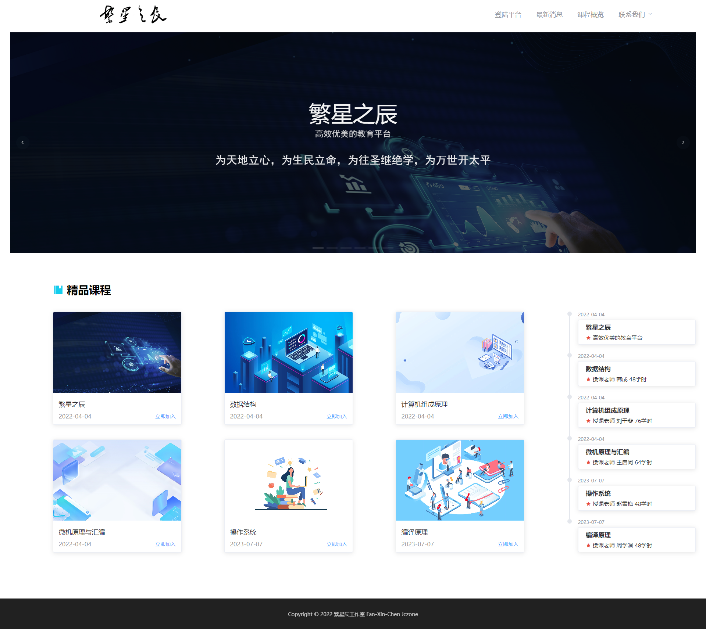

#### 1.2 平台公告

#### 1.3 用户登录

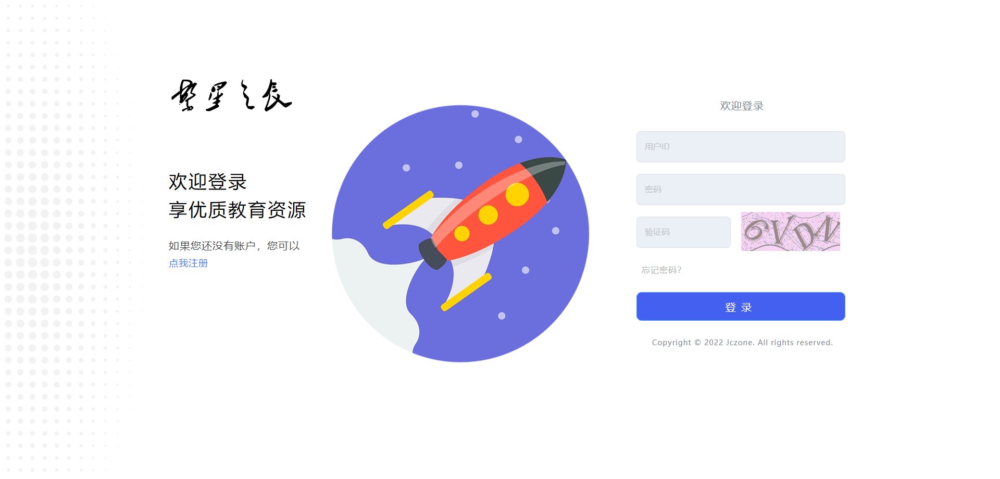

### 2. 用户

#### 2.1 用户首页

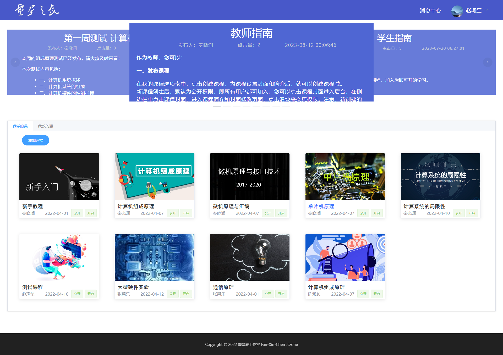

#### 2.2 查看通知

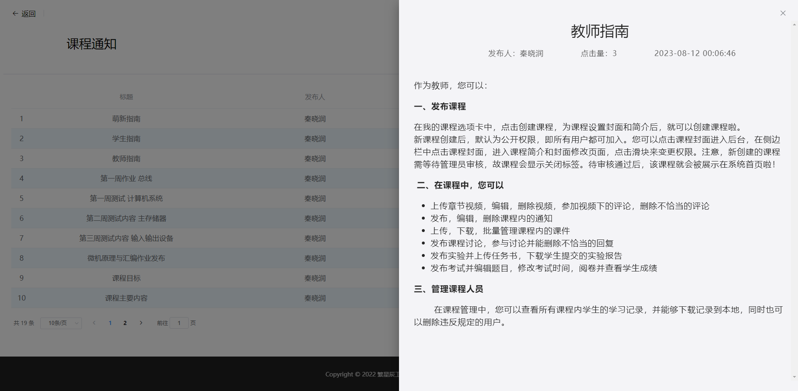

#### 2.3 在线学习

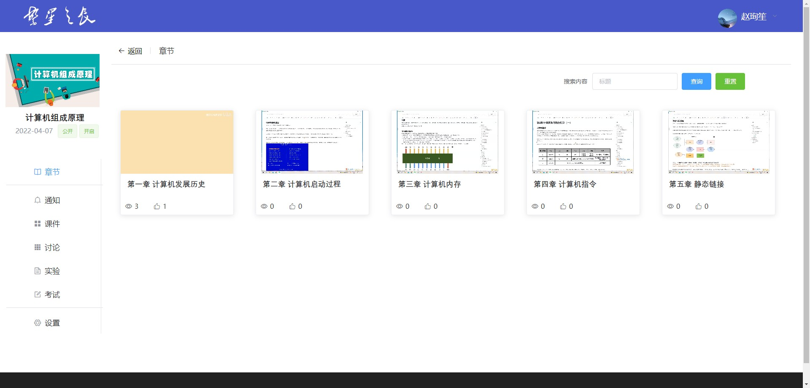

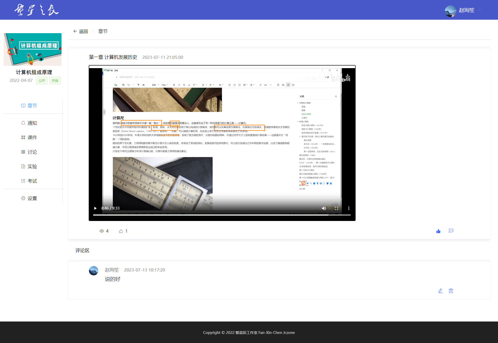

#### 2.4 通知发布

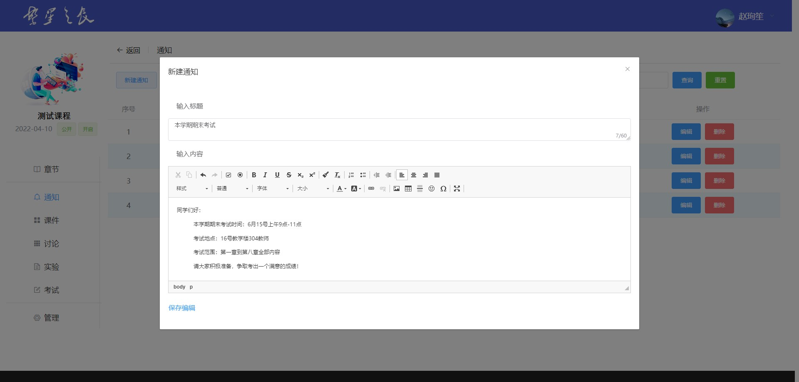

#### 2.5 课件管理-教师

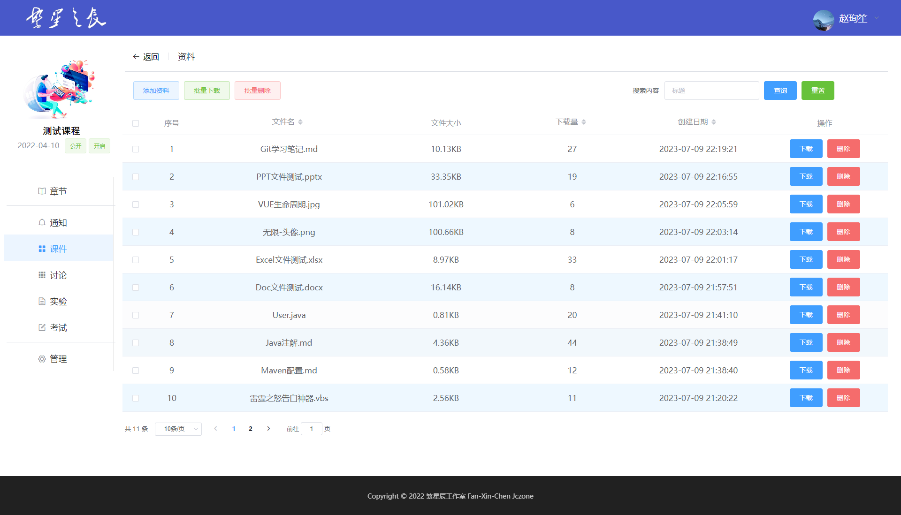

#### 2.6 讨论板块

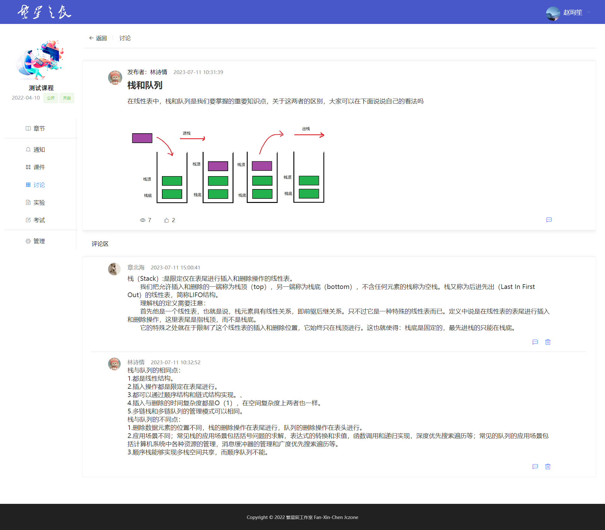

#### 2.7 实验管理

#### 2.8 在线考试

- 出题功能

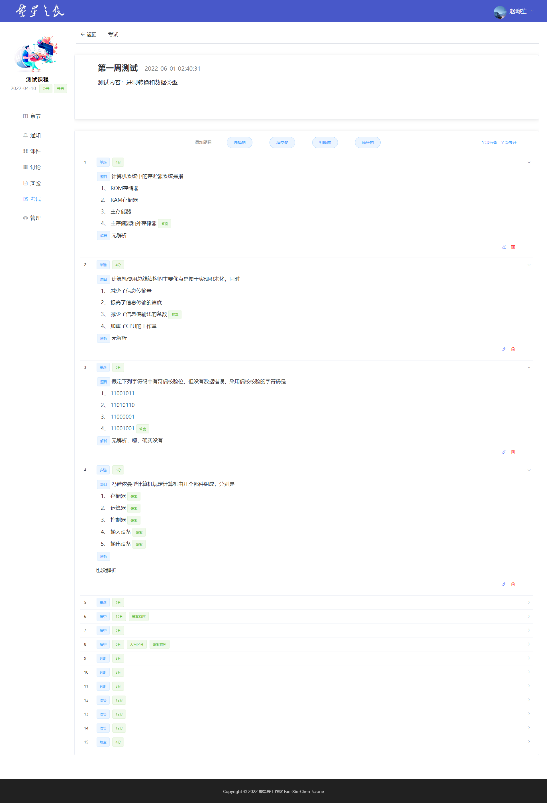

- 考试功能

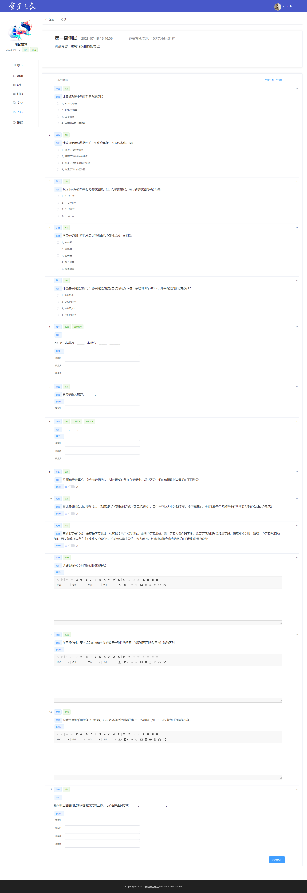

- 判卷功能

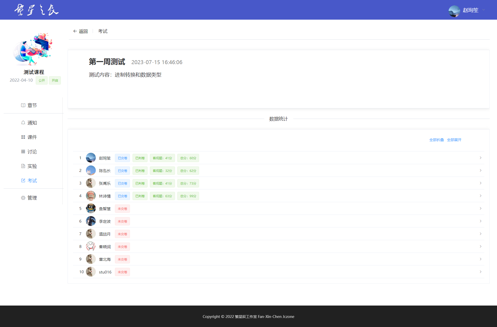

- 在线流程图绘制功能

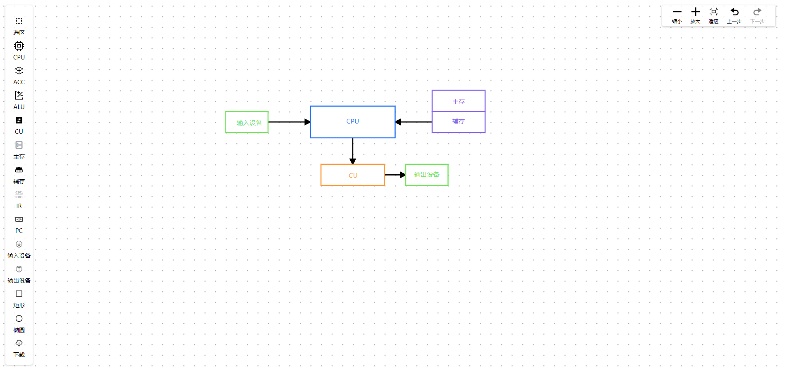

### 3. 管理员

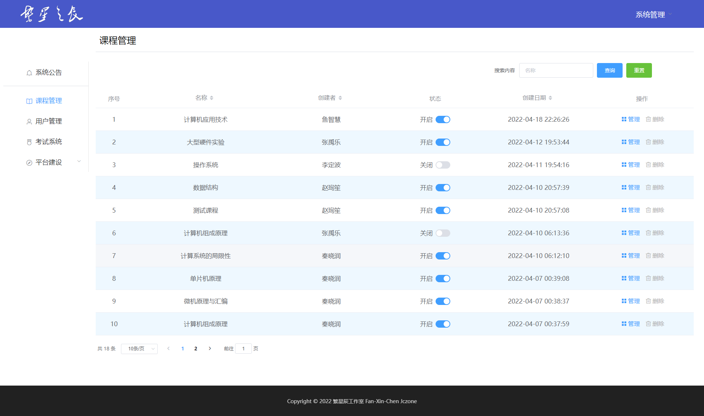

## 四、如何运行项目

  项目前后端分离，建议用IDEA运行后端，WebStorm运行前端，开发环境需安装Node.js和MySQL，数据库用Navicat操作。

### 1. 后端项目（two_hours)

下载后用idea打开项目，初次加载idea会自动下载依赖，最好先配置镜像源或科学上网，这个过程可能需要1h左右。此时可以在MySQL中创建一个名为two hours的数据库，运行后端文件夹中的two hours.sql文件，即可完成数据库初始化。项目加载完成后，在application.yml中修改项目路径为你当前的项目路径，配置好数据库连接，即可运行后端了。

### 2. 前端项目（two_hours_front)

下载后用WebStorm打开项目文件夹，命令`npm install`手动安装node_modules，出现爆红和冲突请后缀`--force`。模块导入完成后，需要配置运行栏，选择npm运行，命令为run，Scripts为serve。

前端项目没有做比例适配，建议浏览器使用100%缩放。

## 五、TODO列表

  朋友你好，由于项目开发时间较早，受当时编程水平的限制（菜），里面存在一些bug和可优化部分没有处理（会处理的，最近在找工作..），以下是测试中发现的一些问题，提供给你参考：

### 1. 用户主页（UserMainPage）

  - **缺少分页**：加入课程以及课程卡片展示区域，都没有做分页查询，当系统中课程数量很多时（20个以上），可能出现数据加载慢，页面过长等问题；

### 1. 章节页面（ChapterTab/StuChapterTab）

  - **数字遮挡**：小卡片上浏览量和播放量没有做分级，采用固定布局时，数字太长会被图标遮挡；
  - **章节删除失败**：章节封面使用video组件展示，虽然禁用了播放等操作，但只要位于该页面，服务器文件将一直处于open状态，导致用户删除视频时，文件删除操作失败（数据库可以成功删除），形成无法索引到的“死数据”；

  ### 2. 视频播放页面（ChapterView/StuChapterView）

  - **刷播放量**：当前策略为用户进入播放页面5秒后，该视频增加1点播放量。实际上这个时间太短，采用百分比时长更合适，但这需要读取到视频时长；

  ### 3. 关于代码

  项目中有些代码，书写不一定规范，甚至有些看起来很蠢，已知的一些问题如下，恳请包容~

  - **数据泄露**：数据传递时没有封装专门的DTO，而是直接使用POJO，导致关键信息被泄露；
  - **冗余查询**：数据存入数据库后，没有直接用返回的ID，而是通过数据内容查询新插入的记录，从而获取ID，这在考试部分较为常见；
  - **冗余条件**：部分数据更新没有采用UpdateWrapper，而是使用了service.update(pojo,queryWrapper)方法完成，不够简洁。实际上可以采用updateById或者UpdateWrapper来封装更新条件。

  ### 4. 关于时间

  - **过度显示**：系统中的时间有些地方是全显示，即具体到时分秒，有些地方则只显示到日期，这在某些地方可能并不合理，比如评论区中的评论，没有必要展示到秒等等；
  - **时区错误**：另一个关于时间的问题，是数据编辑后，时间被mysql自动更新，但由于mysql的时区和idea不匹配，导致更新后的时间比正常时间多8个小时。比如通知创建后，再修改，就会出现时间错误。

## 六、更新日志

- 20230716-修改仓库名称
